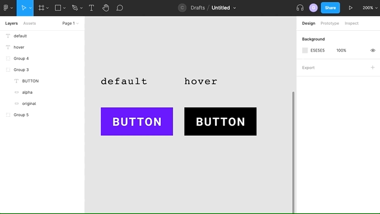

# Color

**TLDR**

- Use HSL instead of using other color representations like HEX or rgba

The most common color systems in web design are hex or rgba. But they are reasonably hard to use when it comes to finding complimentary tones. When trying to find tonal matches one may resort to using an alpha layer of white or black on top of the desired color in Figma.

## HSL

HSL stands for "Hue", "Saturation" and "Lightness". It it much easier to reason about when choosing tones from a color.

> _Using "lighteness" value in hsl to change the lightness of a button_

#### References

[https://www.youtube.com/watch?v=Ceur-ARJ4Wc](https://www.youtube.com/watch?v=Ceur-ARJ4Wc)
